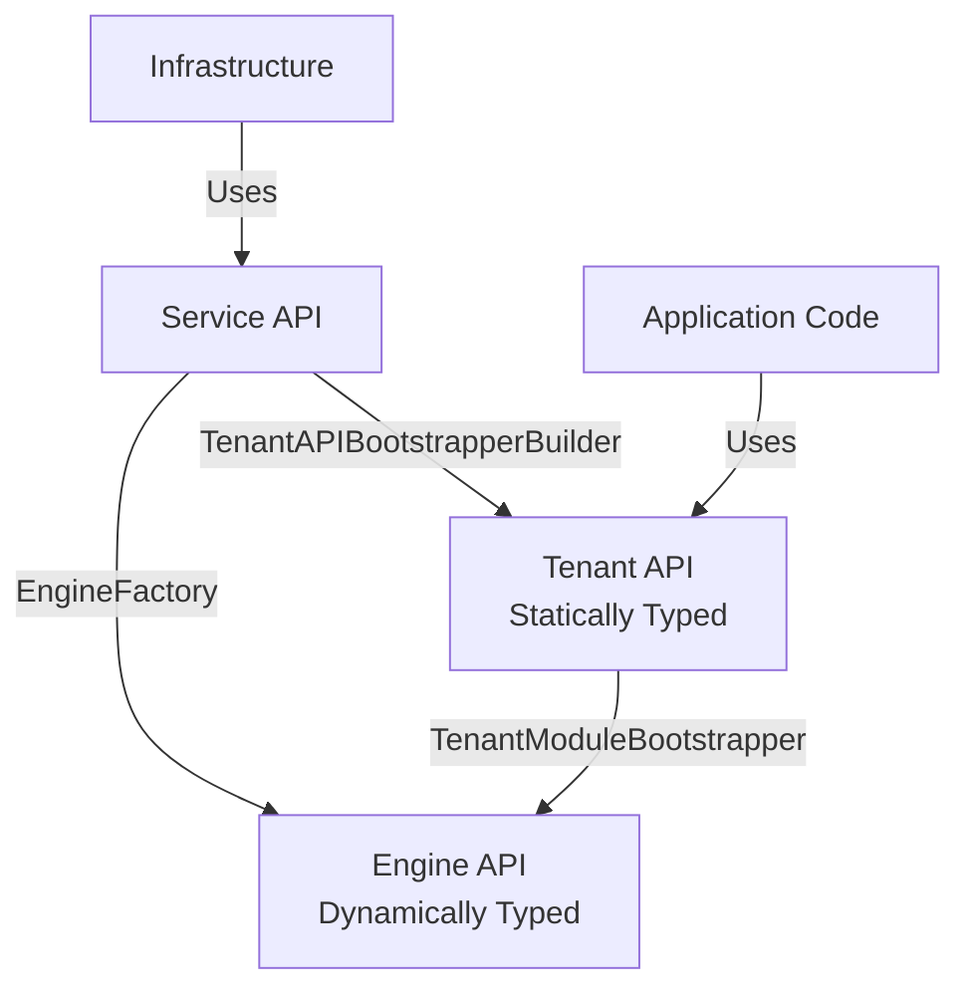

## Three-Layer Design

Viaduct is built on a three-layer architecture that provides strong separation of concerns and enables different personas to work independently:

<CardGroup cols={3}>
  <Card title="Engine API" icon="gear">
    Core GraphQL execution with dynamic typing
  </Card>
  <Card title="Service API" icon="server">
    Integration layer for infrastructure
  </Card>
  <Card title="Tenant API" icon="code">
    Developer-facing API with static typing
  </Card>
</CardGroup>

### Layer Responsibilities

Each layer has a distinct purpose and audience:

| Layer | Purpose | Target Audience |
|-------|---------|----------------|
| **Engine API** | GraphQL query planning and execution | Framework contributors |
| **Service API** | Infrastructure integration (observability, security) | Service engineers |
| **Tenant API** | Business logic implementation | Application developers |

<Info>
The architecture creates strong abstraction boundaries between layers, allowing the engine to evolve for performance improvements while the tenant API evolves independently for better developer experience.
</Info>

## Engine API

The Engine API is Viaduct's core GraphQL execution layer. Located in `engine/api` and `engine/runtime`, it implements the fundamental GraphQL query planning and resolution algorithm.

### Key Characteristics

<Steps>
  <Step title="Dynamic Typing">
    The engine works with dynamically-typed representations of GraphQL values. Input and output objects are represented as simple maps from field name to value, avoiding coupling to any specific type system.
  </Step>
  
  <Step title="Executor Interfaces">
    The engine defines executor interfaces like `FieldResolverExecutor` and `NodeResolverExecutor` that the Tenant API implements. When resolving a field, the engine calls the executor's batch resolution methods.
  </Step>
  
  <Step title="Schema-Agnostic">
    The engine operates on the abstract `ViaductSchema` interface, allowing it to work with different schema representations without coupling to graphql-java or any specific implementation.
  </Step>
</Steps>

### Engine Interface

The primary entry point is the `Engine` interface:

```kotlin engine/api/src/main/kotlin/viaduct/engine/api/Engine.kt
interface Engine {
    val schema: ViaductSchema
    
    /**
     * Executes a GraphQL operation.
     */
    suspend fun execute(executionInput: ExecutionInput): ExecutionResult
    
    /**
     * Resolves a selection set from within a resolver (for subqueries).
     */
    suspend fun resolveSelectionSet(
        executionHandle: EngineExecutionContext.ExecutionHandle,
        selectionSet: EngineSelectionSet,
        options: ResolveSelectionSetOptions,
    ): EngineObjectData
}
```

### Executor Pattern

The engine invokes resolvers through executor interfaces. Here's how field resolution works:

```kotlin
// Engine defines the executor interface
interface FieldResolverExecutor {
    suspend fun batchResolve(contexts: List<Context>): List<FieldValue<T>>
}

// Tenant API provides implementations
class MyFieldResolverExecutor : FieldResolverExecutor {
    override suspend fun batchResolve(contexts: List<Context>): List<FieldValue<User>> {
        // Business logic here
    }
}
```

<Note>
The `TenantModuleBootstrapper` interface connects the tenant layer to the engine by providing mappings from field coordinates to `FieldResolverExecutor` instances and from node types to `NodeResolverExecutor` instances.
</Note>

## Service API

The Service API is the integration layer for service engineers who embed Viaduct into their organization's infrastructure. Located in `service/api`, `service/runtime`, and `service/wiring`.

### Service Engineer Responsibilities

Service engineers integrate Viaduct with:

- **Web serving frameworks** (Spring Boot, Ktor, etc.)
- **Observability platforms** (metrics, tracing, error reporting)
- **Security infrastructure** (authentication, authorization)
- **Dependency injection frameworks**
- **Build and deployment pipelines**

### The Viaduct Object

The `Viaduct` interface is the main entry point for executing GraphQL operations:

```kotlin service/api/src/main/kotlin/viaduct/service/api/Viaduct.kt
interface Viaduct {
    /**
     * Executes a GraphQL operation synchronously.
     */
    fun execute(
        executionInput: ExecutionInput,
        schemaId: SchemaId = SchemaId.Full
    ): ExecutionResult
    
    /**
     * Executes a GraphQL operation asynchronously.
     */
    suspend fun executeAsync(
        executionInput: ExecutionInput,
        schemaId: SchemaId = SchemaId.Full
    ): CompletableFuture<ExecutionResult>
}
```

### Building a Viaduct Instance

Use `ViaductBuilder` for full control over SPI configuration:

```kotlin
val viaduct = ViaductBuilder()
    .withTenantAPIBootstrapperBuilders(bootstrapperBuilders)
    .withSchemaConfiguration(schemaConfig)
    .withMeterRegistry(meterRegistry)
    .withResolverErrorReporter(errorReporter)
    .withGlobalIDCodec(globalIDCodec)
    .build()
```

### Service Provider Interfaces (SPIs)

Viaduct uses SPIs for infrastructure integration. Key SPIs include:

| SPI | Purpose |
|-----|----------|
| `ErrorReporter` | Integrate with error logging infrastructure |
| `FlagManager` | Feature flag integration |
| `GlobalIDCodec` | Custom Global ID encoding/decoding |
| `ResolverErrorBuilder` | Custom error response formatting |

<Tip>
For simpler use cases, use `BasicViaductFactory` which provides sensible defaults without requiring SPI configuration.
</Tip>

### Example: Web Controller Integration

Here's how a Spring Boot controller integrates with Viaduct:

```kotlin
@RestController
class GraphQLController(
    private val viaduct: Viaduct
) {
    @PostMapping("/graphql")
    suspend fun executeGraphQL(
        @RequestBody request: GraphQLRequest
    ): ExecutionResult {
        val executionInput = ExecutionInput.newExecutionInput()
            .query(request.query)
            .variables(request.variables)
            .build()
            
        return viaduct.execute(
            executionInput,
            schemaId = determineSchemaId(request.scopes)
        )
    }
}
```

## Tenant API

The Tenant API is the developer-facing layer where application developers write business logic. Located in `tenant/api` and `tenant/runtime`.

### Key Characteristics

<Steps>
  <Step title="Static Typing">
    Unlike the engine's dynamic representation, the Tenant API provides statically-typed Kotlin classes (GRTs) generated from your GraphQL schema.
  </Step>
  
  <Step title="Type-Safe Builders">
    Every GraphQL type gets a generated builder class with type-safe methods for constructing response objects.
  </Step>
  
  <Step title="Fragment-Based Data Requirements">
    Resolvers declare their data needs using GraphQL fragments in the `@Resolver` annotation, enabling automatic batching and deduplication.
  </Step>
</Steps>

### Resolver Types

The Tenant API provides two primary resolver types:

<CodeGroup>
```kotlin Node Resolver
@Resolver
class CharacterNodeResolver @Inject constructor(
    private val repository: CharacterRepository
) : NodeResolvers.Character() {
    override suspend fun batchResolve(
        contexts: List<Context>
    ): List<FieldValue<Character>> {
        val ids = contexts.map { it.id.internalID }
        val characters = repository.findByIds(ids)
        
        return contexts.map { ctx ->
            characters[ctx.id.internalID]?.let {
                FieldValue.ofValue(CharacterBuilder(ctx).build(it))
            } ?: FieldValue.ofError(NotFoundException())
        }
    }
}
```

```kotlin Field Resolver
@Resolver("name")
class CharacterDisplayNameResolver @Inject constructor(
) : CharacterResolvers.DisplayName() {
    override suspend fun resolve(ctx: Context): String? {
        // Access fields declared in @Resolver fragment
        return ctx.objectValue.getName()
    }
}
```
</CodeGroup>

### Generated Code

For each GraphQL type, Viaduct generates:

1. **GRT (GraphQL Representational Type)** - A value class with suspending getters
2. **Builder** - A builder class for constructing instances
3. **Resolver base classes** - Abstract classes that resolvers extend

Example for a `User` type:

```kotlin Generated Code
package viaduct.api.grts

class User private constructor(...): NodeObject {
    suspend fun getId(): GlobalID<User>
    suspend fun getFirstName(): String?
    suspend fun getLastName(): String?
    
    class Builder(ctx: ExecutionContext) {
        fun id(id: GlobalID<User>): Builder
        fun firstName(firstName: String?): Builder
        fun lastName(lastName: String?): Builder
        fun build(): User
    }
}
```

<Warning>
Attempting to access a field not declared in your resolver's fragment will throw `UnsetFieldException` at runtime.
</Warning>

## Layer Boundaries

The boundaries between layers are carefully designed:



### Engine ↔ Tenant Boundary

The `TenantModuleBootstrapper` interface bridges the two layers:

```kotlin
interface TenantModuleBootstrapper {
    /**
     * Returns field coordinates mapped to executors
     */
    fun fieldResolverExecutors(
        schema: ViaductSchema
    ): Iterable<Pair<Coordinate, FieldResolverExecutor>>
    
    /**
     * Returns node type names mapped to executors
     */
    fun nodeResolverExecutors(
        schema: ViaductSchema
    ): Iterable<Pair<String, NodeResolverExecutor>>
}
```

The Tenant API generates implementations of this interface that wrap your resolver classes, converting between static and dynamic representations.

### Service ↔ Engine Boundary

The Service API uses `EngineFactory` to create `Engine` instances with the appropriate configuration and bootstrappers.

## Benefits of This Architecture

<CardGroup cols={2}>
  <Card title="Independent Evolution" icon="arrows-split">
    Each layer can evolve independently. Performance improvements to the engine don't require changes to application code.
  </Card>
  
  <Card title="Clear Ownership" icon="users">
    Different personas (framework contributors, service engineers, developers) have clearly defined responsibilities.
  </Card>
  
  <Card title="Type Safety" icon="shield">
    Developers work with type-safe generated code while the engine maintains flexibility with dynamic typing.
  </Card>
  
  <Card title="Testing Isolation" icon="vial">
    Each layer can be tested independently with well-defined interfaces between them.
  </Card>
</CardGroup>

## See Also

- [Central Schema](/concepts/central-schema) - How teams contribute to a unified schema
- [Tenant Modules](/concepts/tenant-modules) - Building modular applications
- [Generated Code](/concepts/generated-code) - Understanding GRTs and compilation schemas