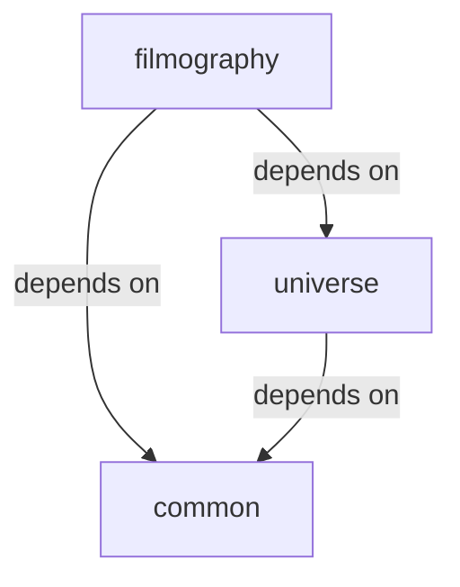

## What is a Tenant Module?

A **tenant module** is a unit of schema together with the code that implements that schema, owned by a single team. It's the fundamental building block of a Viaduct application.

<Info>
Think of a tenant module as a self-contained GraphQL microservice, but without the operational overhead. It contributes its portion of the schema to the central graph and provides resolvers for its fields.
</Info>

### Core Characteristics

<CardGroup cols={2}>
  <Card title="Schema Ownership" icon="file-code">
    Each module owns its GraphQL SDL files that define types, queries, and mutations
  </Card>
  
  <Card title="Resolver Implementation" icon="gears">
    The module provides all resolvers for fields declared in its schema
  </Card>
  
  <Card title="Team Boundaries" icon="users">
    One team owns and maintains each module
  </Card>
  
  <Card title="Independent Deployment" icon="rocket">
    Modules have independent deployment lifecycles within the Viaduct runtime
  </Card>
</CardGroup>

## The TenantModule Interface

Every tenant module implements the `TenantModule` interface:

```kotlin tenant/api/src/main/kotlin/viaduct/api/TenantModule.kt
interface TenantModule {
    /** Metadata to be associated with this module. */
    val metadata: Map<String, String>

    /** The package name for the module */
    val packageName: String
        get() = javaClass.`package`.name
}
```

This interface is minimal by design - the real work happens through the generated code and resolver registration.

### TenantModuleBootstrapper

The bridge between the Tenant API and the Engine API is the `TenantModuleBootstrapper`:

```kotlin
interface TenantModuleBootstrapper {
    /**
     * Returns field coordinates mapped to their executor implementations
     */
    fun fieldResolverExecutors(
        schema: ViaductSchema
    ): Iterable<Pair<Coordinate, FieldResolverExecutor>>
    
    /**
     * Returns node type names mapped to their executor implementations
     */
    fun nodeResolverExecutors(
        schema: ViaductSchema
    ): Iterable<Pair<String, NodeResolverExecutor>>
}
```

<Note>
Viaduct's code generator creates implementations of `TenantModuleBootstrapper` for each module. You don't implement this interface manually - it's generated based on your `@Resolver` annotations.
</Note>

## Module Directory Structure

Each tenant module follows a standard layout:

```
modules/<module-name>/
├── build.gradle.kts                          # Build configuration
├── src/main/viaduct/schema/                  # GraphQL schema files
│   ├── Character.graphqls
│   ├── Film.graphqls
│   └── queries/
│       └── AllCharactersQuery.graphqls
└── src/main/kotlin/                          # Resolver implementations
    └── com/example/modules/<module>/
        ├── characters/
        │   ├── resolvers/
        │   │   ├── CharacterNodeResolver.kt
        │   │   ├── CharacterDisplayNameResolver.kt
        │   │   └── CharacterFilmCountResolver.kt
        │   ├── queries/
        │   │   └── AllCharactersQueryResolver.kt
        │   └── models/
        │       ├── CharacterRepository.kt
        │       └── CharacterBuilder.kt
        └── films/
            ├── resolvers/
            └── queries/
```

### Schema Files Location

GraphQL schema files must be placed in:

```
src/main/viaduct/schema/
```

The Viaduct build plugin discovers all `.graphqls` files in this directory and includes them in schema composition.

<Warning>
Schema files in other locations will not be discovered. Always use the standard `src/main/viaduct/schema/` path.
</Warning>

## Example: Star Wars Demo Modules

The Star Wars demo demonstrates a multi-module architecture:

### Universe Module

Focuses on the in-universe graph of entities:

```graphql modules/universe/src/main/viaduct/schema/Planet.graphqls
type Planet implements Node @scope(to: ["default"]) @resolver {
  id: ID!
  name: String
  diameter: Int
  rotationPeriod: Int
  orbitalPeriod: Int
  gravity: Float
  population: Float
  
  # Relationships to other entities
  residents(limit: Int): [Character!] @resolver
  films(limit: Int): [Film!] @resolver
}

extend type Query @scope(to: ["default"]) {
  allPlanets(limit: Int): [Planet] @resolver
}
```

Corresponding resolver:

```kotlin modules/universe/src/main/kotlin/com/example/starwars/modules/universe/planets/resolvers/PlanetNodeResolver.kt
@Resolver
class PlanetNodeResolver @Inject constructor(
    private val planetRepository: PlanetRepository
) : NodeResolvers.Planet() {
    override suspend fun batchResolve(
        contexts: List<Context>
    ): List<FieldValue<Planet>> {
        val planetIds = contexts.map { it.id.internalID }
        val planets = planetRepository.findByIds(planetIds)
        
        return contexts.map { ctx ->
            val planetId = ctx.id.internalID
            planets[planetId]?.let {
                FieldValue.ofValue(PlanetBuilder(ctx).build(it))
            } ?: FieldValue.ofError(
                IllegalArgumentException("Planet not found: $planetId")
            )
        }
    }
}
```

### Filmography Module

Focuses on films and character appearances:

```graphql modules/filmography/src/main/viaduct/schema/Character.graphqls
type Character implements Node @scope(to: ["default"]) @resolver {
  id: ID!
  name: String
  birthYear: String
  height: Int
  mass: Float
  
  # Computed fields
  isAdult: Boolean @resolver
  displayName: String @resolver
  filmCount: Int @resolver
  
  # Relationships
  homeworld: Planet @resolver
  species: Species @resolver
}

extend type Query @scope(to: ["default"]) {
  allCharacters(limit: Int): [Character] @resolver
  searchCharacter(search: CharacterSearchInput!): Character @resolver
}
```

<Info>
Notice how the `Character` type references `Planet` and `Species` from the universe module. Modules can reference types from their dependencies without code coupling.
</Info>

## Resolver Registration

Viaduct discovers and registers resolvers through annotations and generated code:

<Steps>
  <Step title="Annotate Resolvers">
    Mark your resolver classes with `@Resolver` and extend the generated base class:
    
    ```kotlin
    @Resolver("name")
    class CharacterDisplayNameResolver : CharacterResolvers.DisplayName() {
        override suspend fun resolve(ctx: Context): String? {
            return ctx.objectValue.getName()
        }
    }
    ```
  </Step>
  
  <Step title="Code Generation">
    During build, Viaduct generates:
    - Resolver base classes (e.g., `CharacterResolvers`)
    - A `TenantModuleBootstrapper` implementation
    - Mapping code that connects resolvers to field coordinates
  </Step>
  
  <Step title="Module Bootstrap">
    At runtime, the generated bootstrapper:
    - Instantiates resolver classes (using dependency injection if configured)
    - Wraps them in executor implementations
    - Registers them with the engine by field coordinate
  </Step>
  
  <Step title="Engine Invocation">
    When a field is resolved, the engine:
    - Looks up the executor for that field coordinate
    - Batches requests for the same field
    - Invokes the resolver's `batchResolve` or `resolve` method
  </Step>
</Steps>

### Resolver Base Classes

For each type in your schema, Viaduct generates a resolver container class:

```kotlin Generated: CharacterResolvers.kt
abstract class CharacterResolvers {
    abstract class DisplayName : FieldResolver<...> {
        abstract suspend fun resolve(ctx: Context): String?
    }
    
    abstract class FilmCount : FieldResolver<...> {
        abstract suspend fun resolve(ctx: Context): Int?
    }
    
    abstract class Homeworld : FieldResolver<...> {
        abstract suspend fun resolve(ctx: Context): Planet?
    }
}
```

You extend these base classes in your resolver implementations.

## Module Dependencies

Modules can depend on other modules to access their types:

```kotlin build.gradle.kts
dependencies {
    // Depend on common module for shared types
    implementation(project(":modules:common"))
    
    // Depend on universe module to reference Planet, Species
    implementation(project(":modules:universe"))
}
```

### Dependency Graph

Modules form a dependency graph:



This determines:

- **Schema composition order**: Dependencies are composed first
- **Type availability**: You can only reference types from dependencies
- **Build order**: Gradle builds dependencies before dependents

<Warning>
Circular dependencies between modules are not allowed. Design your module structure to have a clear dependency hierarchy.
</Warning>

## Module Composition

At build time, Viaduct composes all module schemas into the central schema:

<Steps>
  <Step title="Collect Schemas">
    Gather all `.graphqls` files from all modules in dependency order
  </Step>
  
  <Step title="Merge Type Definitions">
    Combine base type definitions and extensions using GraphQL's `extend` keyword:
    
    ```graphql
    # From universe module
    type Character { id: ID!, name: String }
    
    # From filmography module
    extend type Character { displayName: String }
    
    # Result in central schema
    type Character { id: ID!, name: String, displayName: String }
    ```
  </Step>
  
  <Step title="Validate Schema">
    Ensure the composed schema is valid according to GraphQL specification
  </Step>
  
  <Step title="Generate Code">
    Create GRTs and resolver base classes from the central schema
  </Step>
</Steps>

## Module Isolation and Re-entrancy

A key principle of Viaduct modules is **loose coupling**:

<CardGroup cols={2}>
  <Card title="No Code Dependencies" icon="ban">
    Modules don't import each other's resolver code
  </Card>
  
  <Card title="Schema Dependencies Only" icon="file-code">
    Modules only depend on each other's schema definitions
  </Card>
  
  <Card title="Fragment-Based Composition" icon="puzzle-piece">
    Modules compose through GraphQL fragments, not function calls
  </Card>
  
  <Card title="Type Safety Maintained" icon="shield">
    Generated code provides type-safe access across module boundaries
  </Card>
</CardGroup>

### Example: Cross-Module Field Access

The Messaging team extends `User` without depending on Core User's code:

```kotlin
// Messaging module resolver
@Resolver("""
    fragment _ on User {
        firstName
        lastName
    }
""")
class DisplayNameResolver : UserResolvers.DisplayName() {
    override suspend fun resolve(ctx: Context): String {
        val first = ctx.objectValue.getFirstName()
        val last = ctx.objectValue.getLastName()
        return "$first ${last.first()}."
    }
}
```

The engine:

1. Sees the fragment requesting `firstName` and `lastName`
2. Batches all requests for those fields
3. Invokes the Core User module's resolver for those fields
4. Makes the results available to the Messaging resolver via `ctx.objectValue`

<Tip>
This fragment-based composition is called **re-entrancy** - one module's logic composes with another's by issuing GraphQL fragments. See [Re-entrancy](/concepts/re-entrancy) for details.
</Tip>

## Common Module Patterns

### Domain-Based Modules

Organize by business domain:

```
modules/
├── users/          # User domain
├── listings/       # Listing domain
├── reservations/   # Reservation domain
└── payments/       # Payment domain
```

### Layer-Based Modules

Organize by architectural layer:

```
modules/
├── entity/         # Core entity definitions
│   ├── common/
│   ├── user/
│   └── listing/
├── data/           # Data access layer
│   ├── users/
│   └── listings/
└── presentation/   # Client-facing API
    └── search/
```

### Feature-Based Modules

Organize by product feature:

```
modules/
├── search/         # Search functionality
├── checkout/       # Checkout flow
├── messaging/      # Messaging system
└── recommendations/ # Recommendation engine
```

## Module Configuration

Configure modules in your Gradle build:

```kotlin build.gradle.kts
plugins {
    id("com.airbnb.viaduct.module-gradle-plugin")
}

viaduct {
    // Package prefix for generated code
    packagePrefix.set("com.example.starwars")
    
    // Schema file location (default: src/main/viaduct/schema)
    schemaDirectory.set(file("src/main/viaduct/schema"))
}

dependencies {
    implementation("com.airbnb.viaduct:viaduct-api")
    implementation(project(":modules:common"))
}
```

## Testing Tenant Modules

Test modules in isolation using Viaduct's testing utilities:

```kotlin
class CharacterResolverTest {
    private val viaduct = ViaductBuilder()
        .withTenantAPIBootstrapperBuilder(
            // Load only this module
            FilmographyModuleBootstrapper
        )
        .build()
    
    @Test
    fun `test character display name`() = runBlocking {
        val result = viaduct.execute(
            ExecutionInput.newExecutionInput()
                .query("""
                    query {
                        node(id: "Q2hhcmFjdGVyOjE=") {
                            ... on Character {
                                displayName
                            }
                        }
                    }
                """)
                .build()
        )
        
        assertThat(result.errors).isEmpty()
        assertThat(result.getData<Map<String, Any>>()
            ["node"]["displayName"]).isEqualTo("Luke Skywalker")
    }
}
```

## Module Best Practices

<CardGroup cols={2}>
  <Card title="Single Responsibility" icon="bullseye">
    Each module should have a clear, focused purpose
  </Card>
  
  <Card title="Minimal Dependencies" icon="diagram-project">
    Depend only on modules you actually need
  </Card>
  
  <Card title="Clear Ownership" icon="user">
    One team owns and maintains each module
  </Card>
  
  <Card title="Stable Interfaces" icon="handshake">
    Don't break schema contracts other modules depend on
  </Card>
</CardGroup>

### Do's and Don'ts

<CodeGroup>
```text Do
✓ Keep modules focused on a single domain
✓ Use @Resolver fragments to access other modules' data
✓ Extend types from other modules when appropriate
✓ Document which team owns each module
✓ Version your schema changes carefully
```

```text Don't
✗ Create circular dependencies between modules
✗ Import resolver code from other modules
✗ Put unrelated functionality in the same module
✗ Make breaking schema changes without coordination
✗ Duplicate type definitions across modules
```
</CodeGroup>

## See Also

- [Central Schema](/concepts/central-schema) - How modules compose into a unified schema
- [Re-entrancy](/concepts/re-entrancy) - How modules interact through GraphQL
- [Generated Code](/concepts/generated-code) - Understanding GRTs and compilation schemas
- [Architecture](/concepts/architecture) - The three-layer design of Viaduct